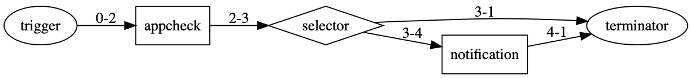

# Example - appstore.exist

## 情境

檢查 app 是否下架，若下架則會發送 chatbot 通知。

### Flow



條件式相關使用請[參考此連結](https://pnetwork.github.io/core.trek.doc/build/html/workflow/conditional.html)


## 所需腳本

- appcheck: 自製腳本，透過 itunes api 來檢查 app 是否下架
- notification: 安裝腳本，發送通知 (若有不正常的)

## 設置及啟動

填入 channel id 至 `inputs/data.yml` 中的以下區間：

```yaml
3-4:
  bot_infos.0:
    type: string
    value: '{input your chatbot id}'
```

啟動

```bash
# 安裝腳本
$ trek install

# 啟動執行環境
$ trek initenv

# 執行
$ trek run
```