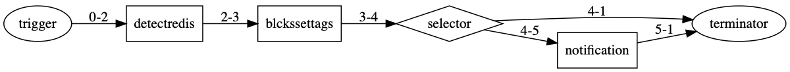

# Example - host.detect.redis

## 情境

監控 redis 的連線。

若連線不到標註 `<redis:unreachable>` 標籤，並發送 chatbot 通知。

### Flow



完整文件請參考：
- [CLI](https://pnetwork.github.io/core.trek.doc/build/html/cli/example2.html)
- [VSCode Extension](https://pnetwork.github.io/core.trek.doc/build/html/extension/example2.html)

## 所需腳本

- detectredis: 自製腳本，撈出特定服務器來檢查 redis 是否正常
- blckssettags: 安裝腳本，針對結果打上標籤
- notification: 安裝腳本，發送通知 (若有不正常的)

## 設置及啟動

填入 channel id 至 `src/graph.yml` 中的以下區間：

```yaml
    - property: bot_infos.0
        value: '{input your chatbot id}' # 此欄位為 chatbot id，請依 marvin 平台設置
        type: 'string'
```

啟動

```bash
# 安裝腳本
$ trek install

# 啟動執行環境
$ trek initenv

# 執行
$ trek run
```