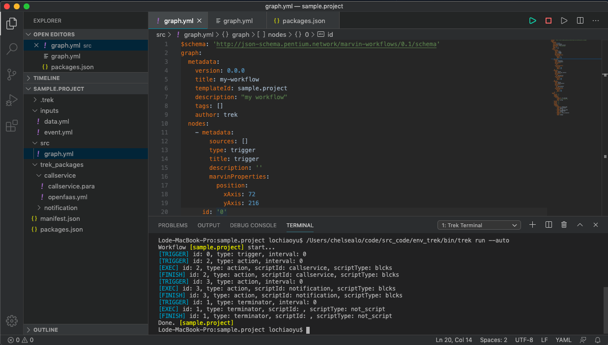

Create a sample project
^^^^^^^^^^^^^^^^^^^^^^^^^

| 建立範本專案：
| 取得所屬權限下項目，並將其結果發送 chatbot 通知。
| Workflow 會需要安裝兩個公眾腳本：

1. 使用 callservice (呼叫 blcks SDK 服務) 腳本取得所屬權限下項目。
2. 使用 notification (傳送通知至指定頻道)腳本來發送訊息。

Step 1. Create a sample project
""""""""""""""""""""""""""""""""""""""""""""""""
| 使用 Command Palette 叫出「 :doc:`../../reference/extension/commands/create_project` 」指令，並填入以下資訊：

.. image:: ../../_static/images/vs_create_sample_project.gif

#. 選擇專案存放位置。
#. 輸入專案名稱為「sample.project」。
#. 輸入「Y」產生範本專案。
#. 右下角顯示建立專案成功訊息，並以 workspace 方式開啟專案

Step 2. Install scripts
""""""""""""""""""""""""""""""""""""""""""""""""
*sample.project/packages.json* 是依賴安裝描述檔，如同 python 的 requiremenets.txt；範例專案已填寫好要下載安裝的腳本有哪些：

- 傳送訊息至指定頻道(notification)
- 呼叫 blcks SDK 服務(callservice)

.. code-block:: json
   :linenos:
   
   {
        "packages": {
            "notification": "==0.5.0",
            "callservice": "==0.3.0"
        }
    }

| 執行指令「 :doc:`../../reference/extension/commands/install_script` 」script repository 下載安裝腳本：
| 輸入 ``*`` 表示安裝 *sample.project/packages.json* 描述的所有腳本，VSCode Terminal 視窗將顯示安裝的進度和結果，安裝下載的腳本檔案放在 *sample.project/trek_packages/* 資料夾下：

.. image:: ../../_static/images/vs_sample_install_script.gif

.. note::
    可下載的腳本清單來自 Pentium 提供的公眾腳本 :ref:`scripts_list`。

Step 3. View workflow template
""""""""""""""""""""""""""""""""""""""""""""""""

在 workflow template *sample.project/src/graph.yml* 的編輯區塊上按右鍵選擇「View Workflow Template Graph」，檢視 workflow 流程圖。

.. image:: ../../_static/images/vs_sample_view_graph.gif

Step 4. Edit test data
""""""""""""""""""""""""""""""""""""""""""""""""
| 範本專案已定義好整個 workflow 流程的長相，在 run 之前，我們需要設置傳送至哪個 chatbot。
| Workflow template 通常是定義流程範本，不會寫死指定特定的資產；在本機執行測試時，我們會需要指定要傳送訊息的 chatbot，這時可以使用 :ref:`config.json <config_trek>` 的工作流程參數檔案 ( :ref:`config_input_data`) 來設置 chatbot ID：

| 首先，我們要先取得 chatbot ID。先至 marvin 平台，也就是 Trek config.json 定義的 :ref:`marvin_url <marvin_url>`，到左側目錄中「資產管理」-> 「通訊帳號」點取要的 chatbot，從下方詳情視窗中找到 ID 欄位並把它複製起來：

.. image:: ../../_static/images/marvin_chatbot.png

| 接著，將 chatbot ID 填入工作流程參數檔案，打開專案資料夾下 *sample.project/inputs/data.yaml*，編輯如下：

.. code-block:: yaml
    :linenos:

    2-3:                        # from node id - to node id
        bot_infos.0:                # property name
            type: string            # property type
            value: 'CH-bka3d88zc'   # property value: chatbot id

Step 5. Run
""""""""""""""""""""""""""""""""""""""""""""""""
| 接著開始在本機執行 workflow 。
| 在 vscode extension 執行工作流程很簡單，先打開 workflow template 檔案，此時編輯視窗右上方會出現按鈕 |run_icon|，按下即可執行：
| 等同於執行「 :doc:`../../reference/extension/commands/run` 」指令。

.. |run_icon| image:: ../../_static/images/run_icon.png

.. image:: ../../_static/images/run.png

| VSCode Terminal 視窗將顯示執行進度和結果：

| 執行完成後可以到 chatbot 中查看已發出的訊息!
| 
| 若需要停止執行的環境請使用 |stop_icon|，等同於執行「 :doc:`../../reference/extension/commands/shutdown_env` 」指令。

.. |stop_icon| image:: ../../_static/images/stop_icon.png

Step 6. Deploy
""""""""""""""""""""""""""""""""""""""""""""""""
| 當在本機開發測試一切就續後，我們可以透過佈署指令直接把腳本、工作流程安裝到 marvin 平台，並在 marvin 平台上實際上操作使用。
| 執行「 :doc:`../../reference/extension/commands/deploy_to_marvin` 」指令，將會進行建置、push to dockerhub、打包和佈署。

.. image:: ../../_static/images/deploy.gif

若 marvin 上已有相同的 workflow template 時會出現是否覆蓋的詢問訊息，輸入 y 直接覆蓋即可：

#. 選擇佈署來源為「The Trek Project」。
#. 輸入「Y」表示覆蓋 Marvin 平台同名腳本及工作流程。
#. VSCode Terminal 視窗將顯示佈署進度和結果。
#. 可以至 Marvin 平台使用此次佈署的腳本及工作流程。

恭喜! Trek 專案完成了。