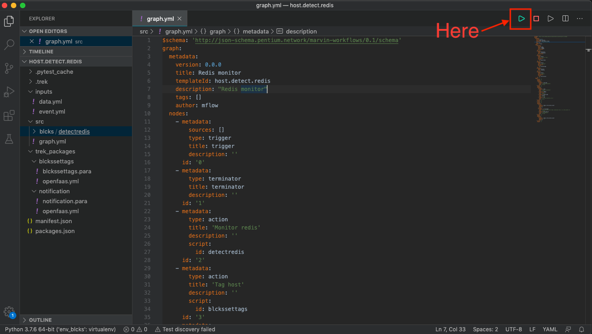
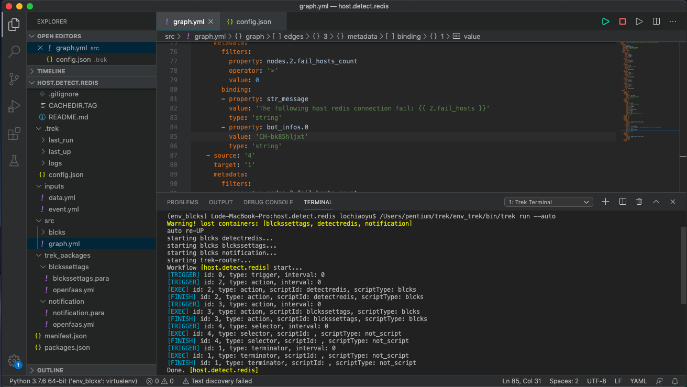

The First Trek Project
------------------------------------
| 假設我們的開發範例：
| 監控 redis 的連線，若連線不到標註 ``<redis:unreachable>`` 標籤，並發送 chatbot 通知。
| 因此 workflow 需要三個腳本：

1. 撈出特定服務器來檢查 redis 是否正常
2. 針對結果打上標籤
3. 發送通知 (若有不正常的)

其中 1 為此次新增腳本，2, 3 則為既有腳本可直接安裝

.. note::
    
    以下專案程式請參考 :exlink:`範例專案 < >`。

Step 1. Create project
^^^^^^^^^^^^^^^^^^^^^^^^
使用 Command Palette 叫出「 :doc:`../../reference/extension/commands/create_project` 」指令，並填入以下資訊：

.. image:: ../../_static/images/create_project.gif

#. 選擇專案存放位置。
#. 輸入專案名稱為「host.detect.redis」。
#. 輸入「N」不產生範本專案。
#. 右下角顯示建立專案成功訊息，並以 workspace 方式開啟專案

Step 2. Create Blcks
^^^^^^^^^^^^^^^^^^^^^^^^^
| 建立一個 Blcks 腳本，用來檢查 redis 連線。
| 使用「 :doc:`../../reference/extension/commands/create_blcks` 」指令建立 Blcks 腳本：

.. image:: ../../_static/images/create_blcks.gif

#. 輸入 Blcks 腳本名稱為「detectredis」，產生的腳本位置於 :exlink:`host.detect.redis/src/blcks/ <src/blcks/>` 下。
#. 定義腳本輸入輸出欄位於檔案 :exblckslink:`detectredis/detectredis.para <detectredis.para>`：

    - Inputs: 服務器標籤。撈取含此標籤的服務器做檢查，此範例標籤會是 ``<redis>``；
    - Outputs: 連線不到的服務器、和其數量。
    
    .. literalinclude:: ../../../example/host.detect.redis/src/blcks/detectredis/detectredis.para
        :language: yaml
        :linenos:

#. 撰寫腳本主程式：

    | 主程式檔案位於  :exblckslink:`detectredis/handler/handler.py <handler/handler.py>`；
    | 撈取含 ``<redis>`` 的服務器，並檢查是否可連線，若連線失敗就把此台服務器加入 outputs 中。

    - 主要程式會放在 process( ) function：

        - Function 參數 (tag_name) 與 para schema 的 inputs 欄位一致。
        - Function return (fail_hosts_count, fail_hosts...) 要與 para schema 的 outputs 定義的欄位一致。

    - 在 ``handler.py`` 中可以使用 Blcks sdk 提供的 service 來操作 Marvin 平台上的資產，請參考 :doc:`../../blcks/index` 。

    .. literalinclude:: ../../../example/host.detect.redis/src/blcks/detectredis/handler/handler.py
        :language: python
        :linenos:
    
    接著，記得將主程式中使用的套件 ``redis`` 寫入 :exblckslink:`handler/requirements.txt <handler/requirements.txt>` 中：

    .. literalinclude:: ../../../example/host.detect.redis/src/blcks/detectredis/handler/requirements.txt
        :language: python
        :linenos:

Step 3. Install scripts
^^^^^^^^^^^^^^^^^^^^^^^^^^
| 從 script repository 安裝腳本。  
| 執行「 :doc:`../../reference/extension/commands/install_script` 」指令，安裝腳本：

- 資產設定標籤(blckssettags)
- 傳送訊息至指定頻道(notification)

| VSCode Terminal 視窗將顯示安裝的進度和結果：

.. image:: ../../_static/images/install_script.gif

| 安裝下載的腳本檔案放在 :exlink:`trek_packages/ <trek_packages>` 資料夾下； 同時也寫入一筆腳本至依賴安裝描述檔 :exlink:`packages.json <packages.json>`：

.. literalinclude:: ../../../example/host.detect.redis/packages.json
   :language: json
   :linenos:

.. note::
    可下載的腳本清單來自Pentium 提供的公眾腳本 :ref:`scripts_list`。

Step 4. Edit workflow template
^^^^^^^^^^^^^^^^^^^^^^^^^^^^^^^^^^
| 接著開啟專案下的 :exlink:`src/graph.yml <src/graph.yml>`，開始編輯 workflow template 檔案，定義好整個工作流程：

.. literalinclude:: ../../../example/host.detect.redis/src/graph.yml
   :language: yaml
   :linenos:

| 在 workflow template :exlink:`src/graph.yml <src/graph.yml>` 的編輯區塊上按右鍵選擇「View Workflow Template Graph」，檢視 workflow 流程圖。

.. image:: ../../_static/images/view_graph.gif

Step 5. Run
^^^^^^^^^^^^^^^^^^^^^^^^^^^^^^
| 在 vscode extension 執行工作流程很簡單，先打開 workflow template 檔案，此時編輯視窗右上方會出現按鈕 |run_icon|，按下即可執行：
| 等同於執行「 :doc:`../../reference/extension/commands/run` 」指令。

| VSCode Terminal 視窗將顯示執行進度和結果：

若需要停止執行的環境請使用 |stop_icon|，等同於執行「 :doc:`../../reference/extension/commands/shutdown_env` 」指令。

Step 6. Deploy
^^^^^^^^^^^^^^^^^^^^^^^^
| 在本機執行正確後，即可佈署至 Marvin 平台。
| 執行「 :doc:`../../reference/extension/commands/deploy_to_marvin` 」指令，將會進行建置、push to dockerhub、打包和佈署。

.. image:: ../../_static/images/deploy.gif

#. 選擇佈署來源為「The Trek Project」。
#. 輸入「Y」表示覆蓋 Marvin 平台同名腳本及工作流程。
#. VSCode Terminal 視窗將顯示佈署進度和結果。
#. 可以至 Marvin 平台使用此次佈署的腳本及工作流程。