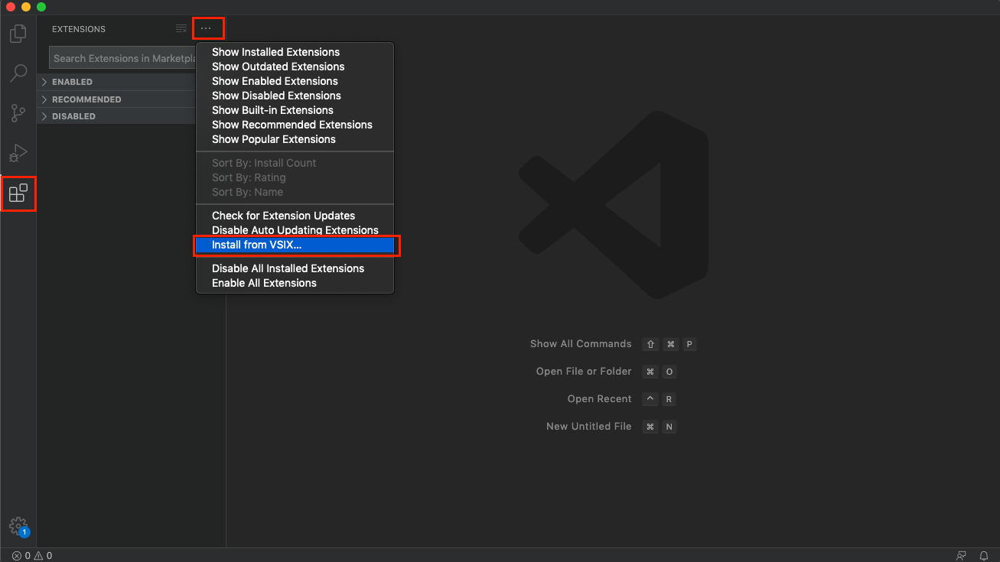
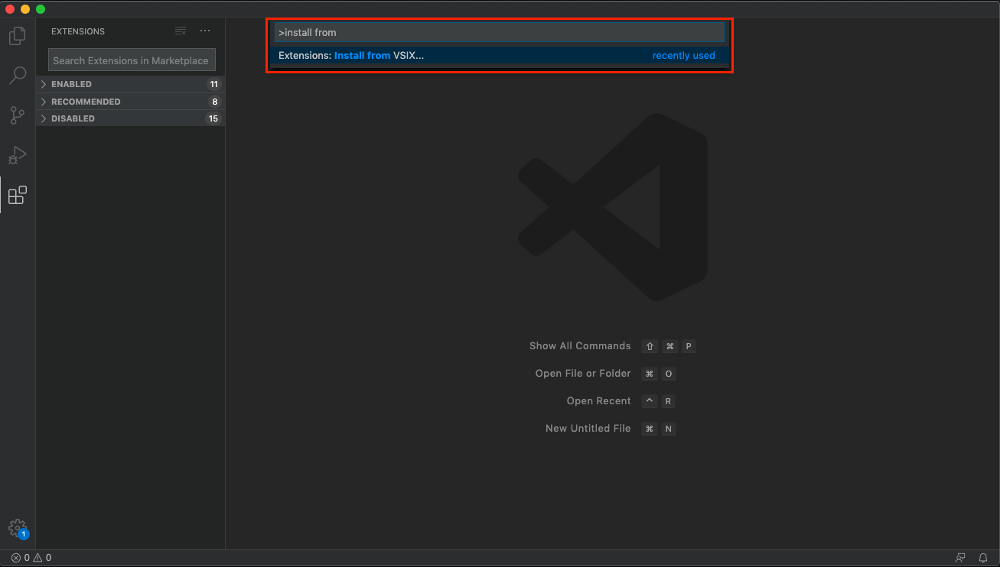

Installing trek vscode extension
-------------------------------------
請先準備好 Pentium trek vscode extension 的 vsix 安裝檔。

請使用以下任一方式安裝：

| **安裝方式 1.**
| 打開 vscode，點選左側 Extension，點選右上角「...」，選擇 「Install from VSIX...」後，選擇 trek vsix 安裝檔：

| **安裝方式 2.**
| 叫出 Command Palette，選擇「Extension: Install from VSIX」後，選擇 mflow vsix 安裝檔。

成功安裝後，右下角會出現「Completed installing the extension Pentium Trek.」提示訊息。

.. image:: ../../_static/images/install_suc.png

叫出 Command Palette，輸入 ``trek`` 顯示多項 trek 指令，即表示安裝完成。

.. image:: ../../_static/images/show_cmds.png
