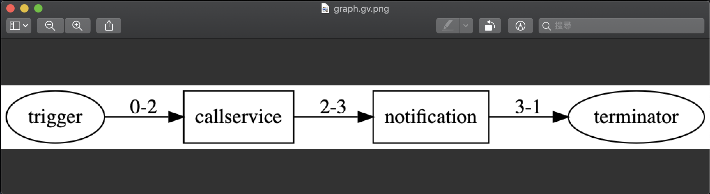

Quick Start 
=========================================

此章節將介紹如何快速的建立、執行、佈署一個 Trek 專案。

Create a Sample Project
--------------------------

| 我們運用 Trek 的範本專案：
| 要取得所屬權限下項目，並將其結果發送 chatbot 通知。
| Workflow 會需要安裝兩個公眾腳本：

    1. 使用 callservice (呼叫 Blcks SDK 服務) 腳本取得所屬權限下項目。
    2. 使用 notification (傳送通知至指定頻道)腳本來發送訊息。

Step 1. Create a sample project
""""""""""""""""""""""""""""""""""""""""""""""""
| 執行 :doc:`../../reference/cli/commands/createproject` 指令建立 Trek 專案「sample.project」，接著會詢問是否要進行專案層級的 ``config.json`` 設置，若不需要可以不輸入文字直接按下 enter：

.. code-block:: shell

    $ trek createproject --example sample.project
    Project [sample.project] creating...
    This utility will walk you through creating a config.json file.
    Marvin url []:
    Marvin JWT []:
    Marvin secret []:
    Done
    
| 想進一步了解 config 欄位 :ref:`請參考 <config_trek>`。
| 創建成功的 Trek 專案目錄結構會如下：

.. code-block:: shell

    $ tree -a sample.project
    sample.project/
    ├── .trek
    │   └── config.json
    ├──inputs
    │   ├── data.yml
    │   └── event.yml
    ├── manifest.json
    ├── packages.json
    └── src
        └── graph.yml

| 若想了解每個檔案、資料夾的意義請參考 :doc:`../start/project_folder`。

Step 2. Install scripts
""""""""""""""""""""""""""""""""""""""""""""""""
*sample.project/packages.json* 是依賴安裝描述檔，如同 python 的 requiremenets.txt；範例專案已填寫好要下載安裝的腳本有哪些：

.. code-block:: json
   :linenos:
   
   {
        "packages": {
            "notification": "==0.5.0",
            "callservice": "==0.3.0"
        }
    }

我們可以直接執行指令 :doc:`../../reference/cli/commands/install` 從 script repository 下載安裝腳本：

    - 傳送訊息至指定頻道(notification)
    - 呼叫 Blcks SDK 服務(callservice)

| 安裝下載的腳本檔案放在 *sample.project/trek_packages/* 資料夾下。

.. code-block:: shell

    $ trek install
    available versions: ['0.5.0', '0.4.0', '0.3.0', '0.2', '0.0.8888', '0.0.0']
    install script notification:0.5.0
    download script from: https://hub.pentium.network/scripts/notification/0.5.0/dist/script.zip
    saving: {your_trek_project_path}/sample.project/trek_packages/script.zip
    100%|███████████████████████████████████████████████████████| 1/1 [00:00<00:00, 4563.99KB/s]
    extracting zip...
    notification:0.5.0 installed
    available versions: ['0.4.1', '0.4.0', '0.3.0', '0.2', '0.0.8888', '0.0.0']
    install script callservice:0.3.0
    download script from: https://hub.pentium.network/scripts/callservice/0.3.0/dist/script.zip
    saving: {your_trek_project_path}/sample.project/trek_packages/script.zip
    100%|███████████████████████████████████████████████████████| 1/1 [00:00<00:00, 6898.53KB/s]
    extracting zip...
    callservice:0.3.0 installed
    $ tree -a
    .
    ├── .trek
    │   └── config.json
    ├── inputs
    ├── src
    │   ...
    └── trek_packages
        ├── callservice
        │   ├── callservice.para
        │   └── openfaas.yml
        └── notification
            ├── notification.para
            └── openfaas.yml

.. note::
    可下載的腳本清單來自 Pentium 提供的公眾腳本 :ref:`scripts_list`。

Step 3. View workflow template
""""""""""""""""""""""""""""""""""""""""""""""""

我們可以使用進階功能查看 sample workflow 流程圖，可以下指令 :doc:`graph <../../reference/cli/commands/graph>`：

.. code-block:: shell

    $ trek graph --show
    digraph "sample.project" {
        dpi=150 rankdir=LR size="8,5"
        0 [label=trigger shape=oval]
        1 [label=terminator shape=oval]
        2 [label=callservice shape=box]
        3 [label=notification shape=box]
        2 -> 3 [label="2-3"]
        3 -> 1 [label="3-1"]
        0 -> 2 [label="0-2"]
    }

Step 4. Edit test data
""""""""""""""""""""""""""""""""""""""""""""""""
| 範本專案已定義好整個 workflow 流程的長相，在 run 之前，我們需要設置傳送至哪個 chatbot。

.. _find_chatbot_id:

| 首先，我們要取得 chatbot ID。請至 marvin 平台，也就是 Trek config.json 定義的 :ref:`marvin_url <marvin_url>`，到左側目錄中「資產管理」-> 「通訊帳號」點取要的 chatbot，從下方詳情視窗中找到 ID 欄位並把它複製起來：

.. image:: ../_static/images/marvin_chatbot.png

| 接著，將 chatbot ID 填入工作流程參數檔案，打開專案資料夾下 *sample.project/inputs/data.yaml*，編輯如下：

.. code-block:: yaml
    :linenos:

    2-3:                        # from node id - to node id
        bot_infos.0:                # property name
            type: string            # property type
            value: 'CH-bka3d88zc'   # property value: chatbot id

Step 5. Run
""""""""""""""""""""""""""""""""""""""""""""""""
| 接著開始在本機執行 workflow 。
| 當程式有異動時，使用 :doc:`run --auto <../../reference/cli/commands/run>` 自動偵測環境是否需要重啟。

.. code-block:: shell

    $ trek run --auto
    Warning! lost containers: [notification, callservice]
    auto re-UP
    starting blcks callservice...
    starting blcks notification...
    starting trek-router...
    Workflow [sample.project] start...
    [TRIGGER] id: 0, type: trigger, interval: 0
    [TRIGGER] id: 2, type: action, interval: 0
    [EXEC] id: 2, type: action, scriptId: callservice, scriptType: blcks
    [FINISH] id: 2, type: action, scriptId: callservice, scriptType: blcks
    [TRIGGER] id: 3, type: action, interval: 0
    [EXEC] id: 3, type: action, scriptId: notification, scriptType: blcks
    [FINISH] id: 3, type: action, scriptId: notification, scriptType: blcks
    [TRIGGER] id: 1, type: terminator, interval: 0
    [EXEC] id: 1, type: terminator, scriptId: , scriptType: not_script
    [FINISH] id: 1, type: terminator, scriptId: , scriptType: not_script
    Done. [sample.project]

| 執行完成後可以到 chatbot 中查看已發出的訊息!
|
| 如果想要手動停止執行環境，可以使用 :doc:`../../reference/cli/commands/shutdownenv` 指令：

.. code-block:: shell

    $ trek shutdownenv
    Closing environment...
    closing blcks callservice...
    closing blcks notification...
    closing trek-router...
    Done

Step 6. Deploy
""""""""""""""""""""""""""""""""""""""""""""""""
| 當在本機開發測試一切就續後，我們可以透過佈署指令直接把腳本、工作流程安裝到 marvin 平台，並在 marvin 平台上實際上操作使用。

| 自動佈署 :doc:`../../reference/cli/commands/deploy` 動作包含建置、打包、佈署：

.. code-block:: shell

    $ trek deploy -a --autobuildpush --autopack
    Deploy workflow with all packages...
    Deploying: {your_trek_project_path}/sample.project/bin/sample.project-0.0.0.zip
    Done

若 marvin 上已有相同的 workflow template 時會出現是否覆蓋的詢問訊息，輸入 y 直接覆蓋即可：

.. code-block:: shell

    Workflow duplicated: sample.project
    Do you want to overwrite remote template? [y/N]: y

恭喜! Trek 專案完成了。